# Francis Lam's Terminal Application - Roulette (T1A3)

## R4 - Link to GitHub Repository
- [GitHub repo](https://github.com/frankie3388/Terminal-app-T1A3.git)

## R5 - Style Guide
I used the PEP8 style guide to structure or style my code. It can be seen in the code that each line does not exceed 79 characters, which is the standard for PEP8 (Rossum, Warsaw & Coghlan 2001). Indentation has been implemented on the the function below, the parameters were indented by 4 spaces to distinguish it from the rest of the function, which is the standard for PEP8:-
```
def win_lose(
        what_you_bet_on, random_number, next_bet, total_funds, color, even_odd):  
    # This function displays if the user has won and how much
    # they have won.
    winnings = 0
    for element in what_you_bet_on:
        if element == random_number:
            winnings = (next_bet * 18) + next_bet
            amount_won = winnings - next_bet
            print(f"You won ${amount_won} as the number was {element}")
            total_funds += winnings
        elif element == even_odd or element == color:
            winnings = (next_bet * 2)
            total_funds += winnings
            amount_won = winnings - next_bet
            print(f"You won ${amount_won} as the number was {element}")
    print(f"Your remaining funds are ${total_funds}")        
    
    return total_funds
```
Other lines of code that exceeded 79 characters were indented and aligned with the opening delimiter(Rossum, Warsaw & Coghlan 2001). Also, added in block comments inside the function to describe the features of each function, which is good practice in PEP8.  


## R6 - Develop a list of features that will be included in the application  
There are a total of nine features in this application. These are:-
- **Terminal Menu (Navigation menu)** - This feature lets the user choose if they want to play the game of roulette, view the result history of the game, or exit the app. It uses a while loop to ask the user what option to enter, '3' exits out of the loop and closes the app. If the user choose '1', it enters the game of roulette. I declared two local variables at the start of the condition, 'total_funds' and 'what_you_bet_on', which are 0 and '[]' respectively. This ensures that the 'funds()' function will ask the user to enter funds when they enter the game of roulette. I assigned the total_funds variable to the 'funds()' and 'play()' functions because I wanted to print out the 'total_funds' variable amount once the user exited the game of roulette. Option '2' lets the user view a history of the results by calling the 'view_history()' function.
If the user types in anything else, it prints out 'Invalid Input' and asks the user again.

- **Enter Funds** - The funds function lets the user enter funds to play with in the game of roulette. A minimum amount of $5 can be entered. There is a minimum of $5 as the minimum bet amount is $5. A while loop is used to achieve this, the input() method in the function will keep asking the user until an amount above $5 is entered. This then gets assigned to the 'total_funds' local variable. I put a user_input parameter in this function and set the default value to None as I wanted to test this function with pytest without using monkeypatch method. This function also catches the 'ValueError', so if a user enters anything other than whole integers, this error catches it. I also, put in an Exception error at the end of the function, in case there is any other error that is unforeseen. I called this function in the main navigation menu and assigned it to total_funds variable, so that the 'play()' function has access to the total_funds variable as an argument.

- **Betting** - This feature essentially has two features, one is being able to enter a bet amount and the other is being able to choose what to bet on (i.e. even, odd, black, red, etc.). The 'betting()' function takes in two parameters 'what_you_bet_on' and 'total_funds', and allows the user to enter the bet amount. The bet amount must be a whole integer that is greater than or equal to 5, otherwise the function will not end when called. It returns the 'bet' variable (local variable).  
The 'bet_selection()' function has a parameter of 'what_you_bet_on' which is an empty list in the navigation menu. This function lets the player enter what to bet on. They can bet on 'even', 'odd', 'black', 'red', or any number between 0 and 36 inclusive. If they enter a valid choice, it appends the choice to the 'what_you_bet_on' list variable. If they enter an invalid choice like a number that is outside of the 0 - 36 range or any other typo, a print statement will be displayed and the function will run again. Both of these function were used in the 'play()' function as it decides if the game should be started.

- **Generate Random Number** - The function 'display_result()' generates a random number 0 - 36 inclusive and iterates through the 'data_set' variable which is a list of dictionaries containing all the numbers from 0 - 36 and their respective colors and even/odd values. The result gets added into a csv file with the 'add_history()' function. I also, used the 'colored' library to make the text red or black according to the number generated. This function gets called in the 'play()' function.

- **Display win amount** - The 'win_lose()' function has a number of parameters and displays the amount won if the user won and the remaining funds after the game. This function takes in arguments 'what_you_bet_on', 'random_number', 'next_bet', 'total_funds', 'color', and 'even_odd'. It iterates through the list variable of 'what_you_bet_on' and compares it to what was generated from the 'display_result()' function. This is called in the 'play()' function.

- **Play feature** - The 'play()' function is used to control the flow of the game of roulette. It takes four parameters, 'what_you_bet_on', 'file_name', 'play_roulette', 'total_funds'. It contains most of the functions in this application such as the 'bet_selection()' function, 'betting()' function, 'display_result()' function, and 'win_lose()' function. This function lets the user stay in the game of roulette as long as the user agrees and has more than $5 in funds. The function basically starts off with the user choosing what to bet on, then placing a bet amount on that bet, the bet amount will be removed from the total funds and the remaining funds will be displayed. Then the user will be asked if they want to continue betting or start the game. If the user chose 'yes', the game will start and a random number will be generated, then the result will be displayed telling the player if they won and how much. Then another prompt will be displayed asking if the player wants to exit or continue playing roulette. If the user chose 'no', the game will go back through the while loop. If the 'total_funds' variable is less than 5, then 'else' conditional statement will be executed, which means no further bets can be made and the player can only start the game.

- **Result History** - The result history feature has two features, one is adding the results to the 'history.csv' file after every game of roulette and the other is viewing the history of results. The 'add_history' function takes in the parameters file_name, color, even_odd, random_number. It is called in the 'display_result()' function which generates the random number, then the result get recorded in the history.csv file. The 'view_history()' function opens the 'history.csv' file in read mode and displays all the results row by row in the terminal. This function is called in the navigation menu with option 2.

## R7 - Develop an implementation plan
I used Trello and the Kanban board method to plan and track the progress of the Terminal application as can be seen in the screenshot below.
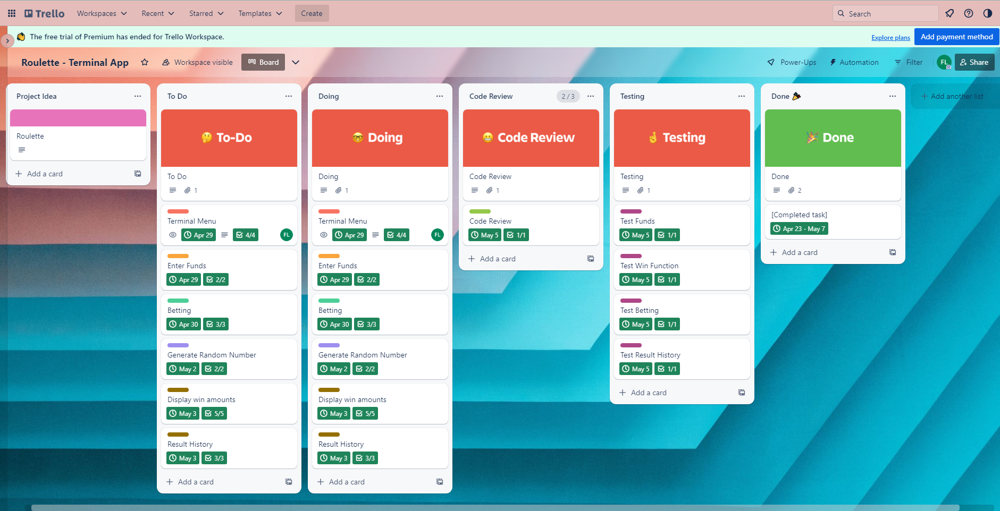
- [This is a link to the kanban board on Trello](https://trello.com/b/jysgGcfC/roulette-terminal-app)

- **Terminal Menu (Navigation menu)** - Below is a screenshot of the terminal menu implementation plan and checklist items. This was 'priority 1' as it was the starting point of the app. The due date for this feature card was 29th April 2023.
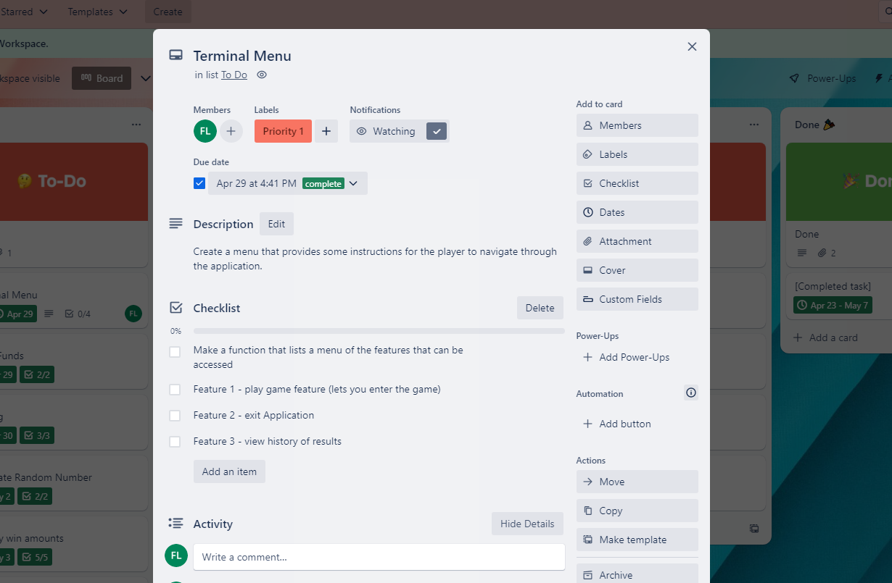

- **Enter Funds** - Below is a screenshot of the enter funds feature card that contains the checklist items and is considered priority 2. The due date for this feature card was 29th April 2023.
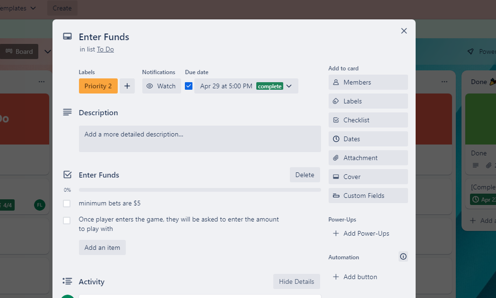

- **Betting** - Below is a screenshot of the card for the betting feature. It contains a checklist of three items and is considered priority 3 and was due on 30th April 2023.
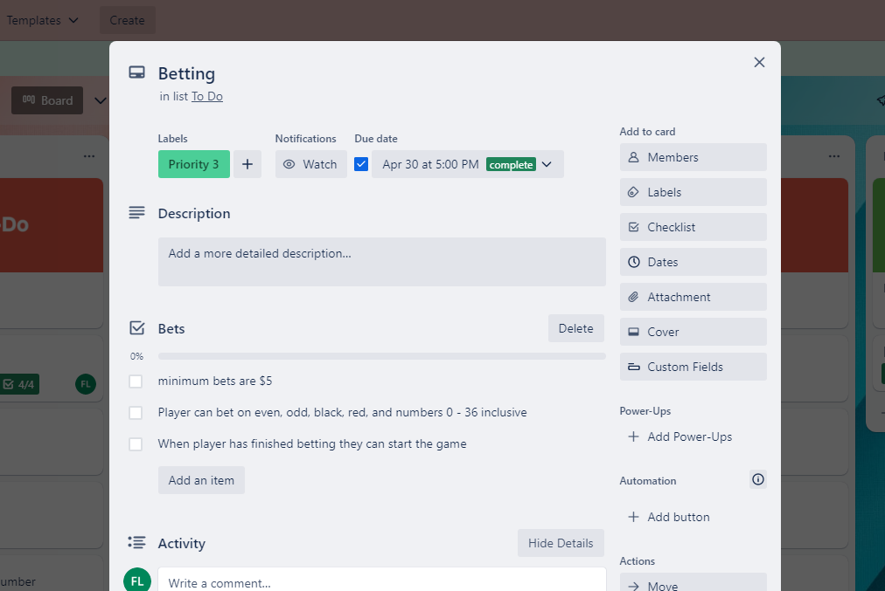

- **Generate Random Number** - Below is a screenshot of the card for the generate random number feature. It has two checklist items and is considered priority 4. The due date for this feature was 2nd May 2023.
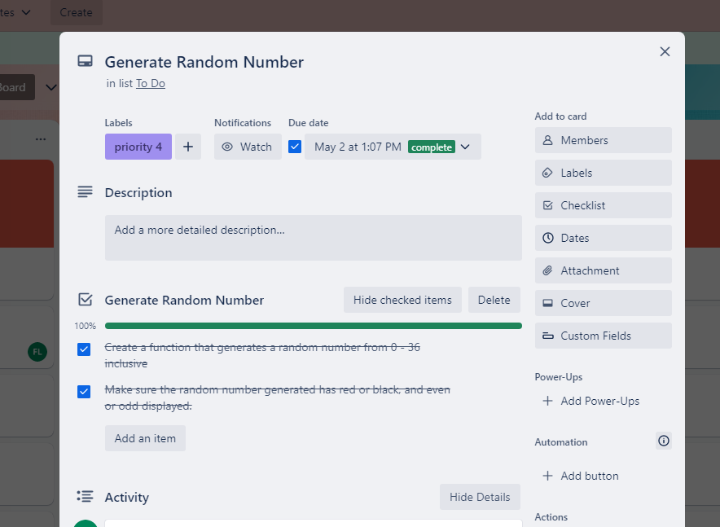

- **Display win amount** - Below is a screenshot of the card for the display result feature. This feature has five checklist items and is considered priority 5. The due date for this feature was 3rd May 2023.
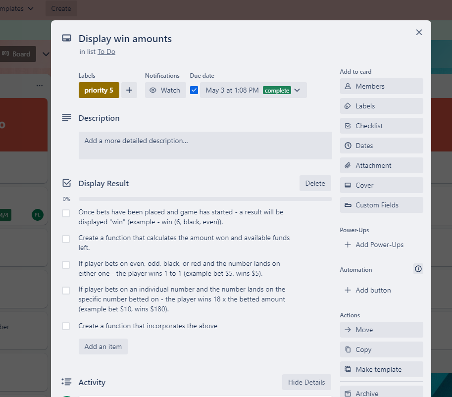

- **Result History** -  Below is a screenshot of the card for the result history feature. This feature has three checklist items and is considered priority 5. The due date for this feature was 3rd May 2023.
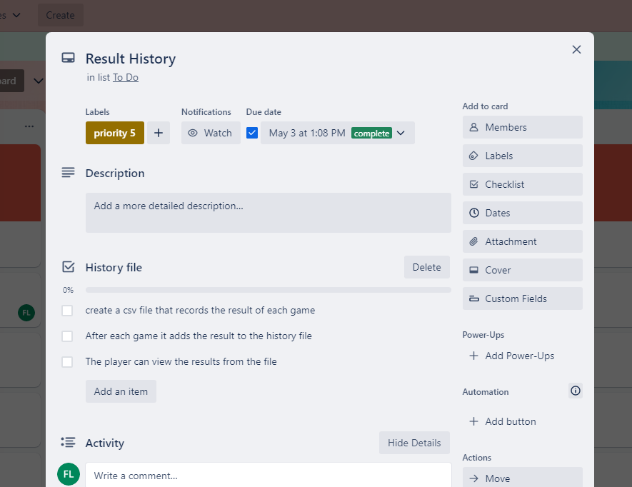


## R8 - Design help documentation which includes a set of instructions which accurately describe how to use and install the application.
To install the application go to [this link](https://github.com/frankie3388/Terminal-app-T1A3.git). The github repo will have to be cloned by clicking on the green button that says '<> code' as shown in the screenshot below.  
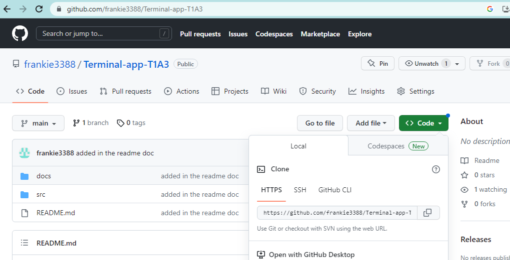  

Copy the HTTPS link, and open Git Bash. Choose which directory you want to install the cloned repository. Type 'git clone', then paste in the HTTPS link that was copied from github and press enter. It should look like the screenshot below.
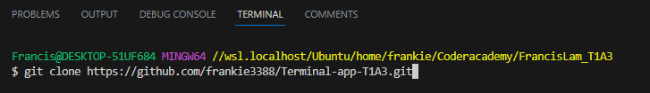  

Once you have cloned the repository, open the cloned repository in VScode.
To run the application, you have to use the wsl terminal. In the wsl terminal, type in './run.sh', this will run the application. The application will install any dependencies required like python, colored and pytest.  
Once you have run the application, you should see that the application has started as seen in the screenshot below.
  

You are given three options to start with, type '1' to play roulette, '2' to view the history of results, and '3' to exit the application. If you type in '1' you enter the game of roulette and a prompt will come up asking to enter funds as seen in the screenshot below.  
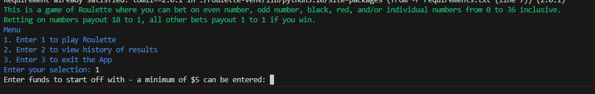  

After entering in the funds (must be whole numbers only and greater than 5) press enter and another prompt will come up asking what you would like to bet on. You can choose to bet on 'even', 'odd', 'black', 'red', or any number between 0 and 36 inclusive. Only enter one bet at a time. The bet you entered will then show up in another prompt asking how much you want to bet for what you have chosen. This can be seen in the screenshot below.  
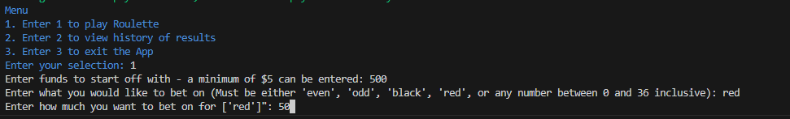 

After entering the bet amount, it will display your remaining funds and a prompt of whether you want to start the game or continue betting will be asked. If you choose 'yes' the game will start, but if you choose 'no', you will continue to place bets. The below screenshot shows 'no', thus you can choose to make more bets. The next bet that you make appends the bet to a list data structure. As you can see in the screenshot below that the first bet was 'red' and the next bet is 'even'.
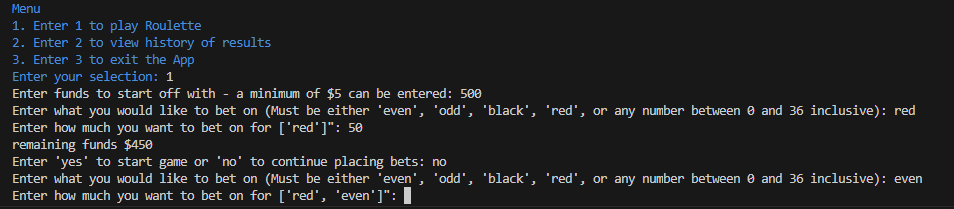  

If you type in 'yes' to start the game, a random number will be generated. The terminal will display the number landed on and if it is red or black and even or odd. It will also display the amount won if you won in the game, and the remaining funds. Also, a prompt of 'do you wish to exit the game?' will be asked. This is shown in the screenshot below.  
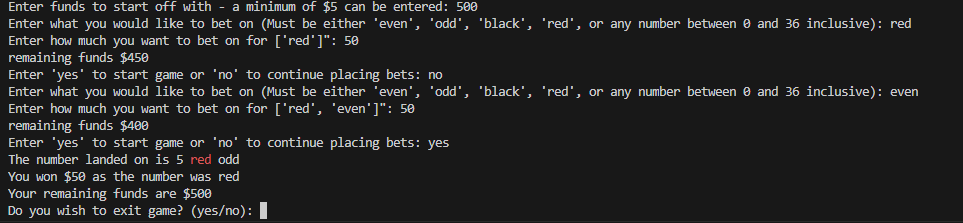  

If you choose 'no', you will be able to bet on a new game and the process repeats. If you run out of funds, or try to make a bet that exceeds your total funds, you won't be able to make anymore bets and will be asked to start the game as shown in the screenshot below.  
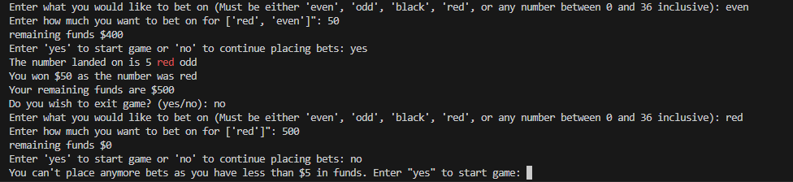  

Once you choose to exit the game, a statement in yellow will be displayed showing the amount of money you left the game with, and will take you back to the navigation menu, as shown below.  
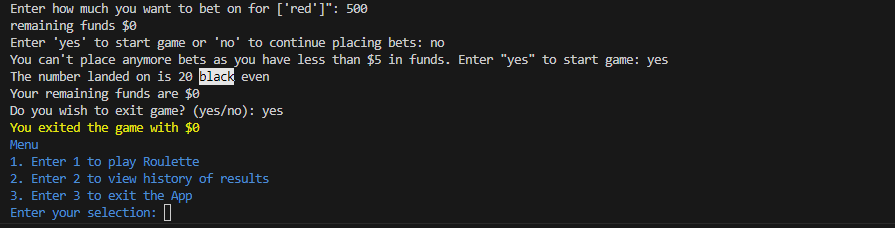  

If you enter '2' in the terminal navigation menu, all the prior results of roulette will be displayed in a list structure. This data is stored in a csv file called ' history.csv'. This can be seen below.  
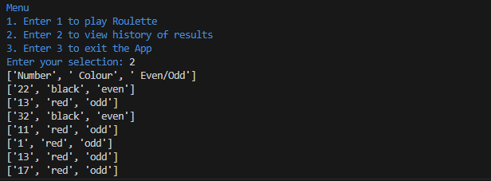  

If you enter '3', it exits the application. A statement of 'Thanks for playing Roulette' will be displayed.

# Reference List
- Rossum, G, Warsaw, B, Coghlan, N 2001, *PEP 8 – Style Guide for Python Code*, viewed 5 May 2023, https://peps.python.org/pep-0008/